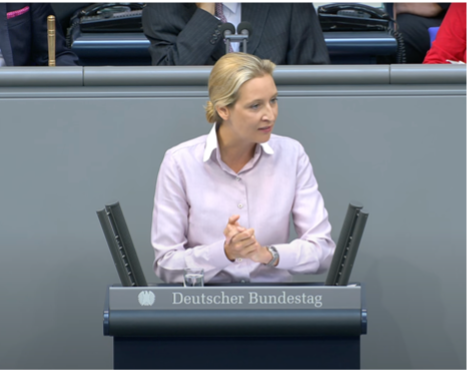
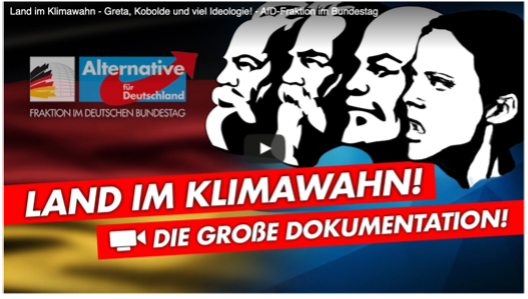

Wie keine andere Partei im Bundestag polarisiert die AfD mit Sprache. Eine der wichtigsten Kommunikationsweisen hierbei ist die kalkulierte Provokation, ein Mittel, um mit hoher Wahrscheinlichkeit heftige öffentliche Reaktionen und Emotionen auszulösen. Um dieses Ziel zu erreichen, verwenden AfD-Politiker_innen plakative Wortneuschöpfungen. Oft sind sie nach einem ganz einfachen Prinzip aufgebaut: Man nehme zwei Wörter aus unterschiedlichen Kontexten und füge sie zu einem neuen Wort zusammen. Nach dem Prinzip: Kartoffel + Schmarrn = Kartoffelschmarrn. 

So harmlos diese Taktik klingt, so gefährlich sind ihre Auswirkungen für die Gesellschaft. Denn wer genauer hinschaut, der versteht, dass mit den Begriffen, die die AfD verwendet, ganze Menschengruppen angegriffen und abgewertet werden sollen. Je öfter man diese Wörter hört oder liest, desto größer ist die Wahrscheinlichkeit, dass man sie irgendwann selbst schreibt oder ausspricht. 

Seid vorsichtig und macht eure Mitmenschen auf folgende Bedeutungen aufmerksam:

- **Klimawahn**: Mit diesem Wort wird allen, die sich in irgendeiner Weise für Klimaschutz engagieren, unterstellt, dass sie übertreiben und „wahnsinnig“, also krank, sind. Klimaschützer_innen soll damit ihre Glaubwürdigkeit genommen werden.
- **Ökodiktatur**: Dieses Wort dient der Abwertung einer ökologisch orientierten Politik, wie sie etwa die Grünen verfolgen. Es wird auf eine Herrschaftsform angespielt, die Maßnahmen zugunsten des Klimaschutzes auch mit freiheitseinschränkenden Mitteln durchsetzen will. Sie hat noch nie existiert und wird von keiner Partei angestrebt.
- **Flüchtlingswelle**: Dieses Wort soll den Eindruck erwecken, als würden Migrant_innen wie eine Welle das Land überschwemmen und Chaos stiften. Es stellt Migration somit allgemein negativ und geflüchtete Menschen als Naturgewalt dar. Besonders problematisch ist, dass das Wort schon lange Einzug in die Alltagssprache vieler Menschen gefunden hat und auch von diversen Medien ohne Hintergedanken verwendet wird.
- **Migrationswende**: Auch dieses Wort wertet die Fluchtbewegung als ganze ab und wendet sich gezielt gegen alle Menschen mit Migrationshintergrund. Unter den Begriff fallen die Ziele der AfD, alle Grenzen zu schließen und Migrant_innen sowie deutsche Staatsbürger mit Migrationshintergrund aus Deutschland abzuschieben.
- **Messermänner**: Mit diesem Wort wird behauptet, dass männliche Muslime immer mit Messern bewaffnet und gewaltbereit seien. Wie auch das Wort „Kopftuchmädchen“ soll es in der breiten Öffentlichkeit Angst schüren und anti-muslimischen Rassismus ankurbeln.

# Quellen
1.	Zeit Online. (23. Oktober 2019). AfD: Die Macht der Komposition. https://www.zeit.de/kultur/2019-10/afd-rhetorik-wortschoepfungen-rechtspopulismus-linguistik
2.	Deutschlandfunk. (21. Januar 2024). Kommunikation der AfD. Provozieren, polarisieren, normalisieren. https://www.deutschlandfunk.de/kommunikationsstrategien-rhetorik-afd-neue-rechte-100.html
3.	Schreiber, F. (2021). Entwaffnet Sie! Die Strategien von AfD und Co. erkennen und bekämpfen. München: Riva Verlag.
4.	Pfahl-Traughber, A. (2019). Die AfD und der Rechtsextremismus: Eine Analyse aus politikwissenschaftlicher Perspektive (essentials). Springer VS. Kindle Edition.

5.	Bundeszentrale für politische Bildung (bpb). (2023). Rechtspopulistische Lexik und die Grenzen des Sagbaren. https://www.bpb.de/themen/parteien/rechtspopulismus/240831/rechtspopulistische-lexik-und-die-grenzen-des-sagbaren/
6.	Katapult Magazin. (11. April 2016). Sprachanalyse: Die Sprache der AfD. https://katapult-magazin.de/de/artikel/die-sprache-der-afd
7.	Spiegel Online. (17. Mai 2020). Wie die AfD unsere Sprache nach rechts verschiebt. https://www.spiegel.de/politik/deutschland/afd-sprache-wie-gutmensch-fruehsexualisierung-co-wieder-teil-unserer-sprache-werden-a-00000000-0003-0001-0000-000002561315
8.	Tagesspiegel. (21. Februar 2020). „Gaulands Sprache ist der schlecht verkleidete Jargon von Gangstern“. https://www.tagesspiegel.de/politik/gaulands-sprache-ist-der-schlecht-verkleidete-jargon-von-gangstern-7330918.html
9.	Deutschlandfunk Kultur. (13. Juli 2019). Literaturwissenschaftler Heinrich Detering: Die rhetorischen Tricks der AfD. https://www.deutschlandfunkkultur.de/literaturwissenschaftler-heinrich-detering-die-rhetorischen-100.html
10.	FAZ. (6. April 2016). Sprache von Pegida und AfD: Das Wörterbuch der Neuesten Rechten. https://www.faz.net/aktuell/feuilleton/debatten/aus-welchen-woertern-afd-und-pegida-kampfbegriffe-machen-14157466.html
11.	DISS Duisburg. (28. Dezember 2017). Rechte Provokationsstrategie: Der kalkulierte Tabubruch. https://www.diss-duisburg.de/2017/12/rechte-provokationsstrategie-der-kalkulierte-tabubruch/

**Bilder**

Deutscher Bundestag. (16. Mai 2018). Generalaussprache zur Regierungspolitik - Dr. Alice Weidel (AfD) [Video]. YouTube. https://www.youtube.com/watch?v=Vc8Ra3FmE2Y

AfD-Fraktion Bundestag. (31.01.2020). Land im Klimawahn - Greta, Kobolde und viel Ideologie! - AfD-Fraktion im Bundestag ) [Video]. YouTube. https://www.youtube.com/watch?v=IRHg_0zNmqQ
